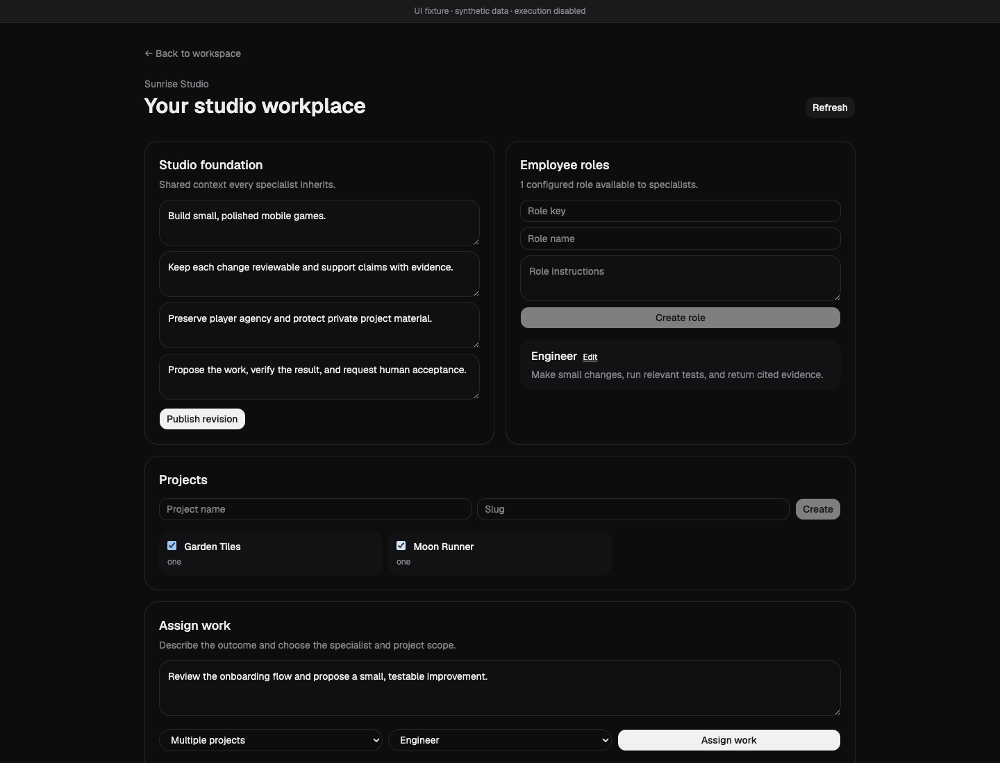

# Assignment controls visual evidence

The screenshot renders the actual StudioPage from the assignment UI slice in an isolated browser fixture. It uses synthetic projects, roles and specialists; RPC mutations are disabled. The visible banner identifies this boundary.

At 1440 × 1100, the objective, named specialist, multiple-project selection and existing role controls are visible. A focused Playwright test passed using installed Chrome, checking objective/specialist requirements, one/multiple/studio scope validation and preserved role editing.

This is UI interaction evidence only. Database execution, model runs, Docker computers, employee hosts and human acceptance have not been demonstrated by this image. Docker verification was interrupted by host disk exhaustion.
