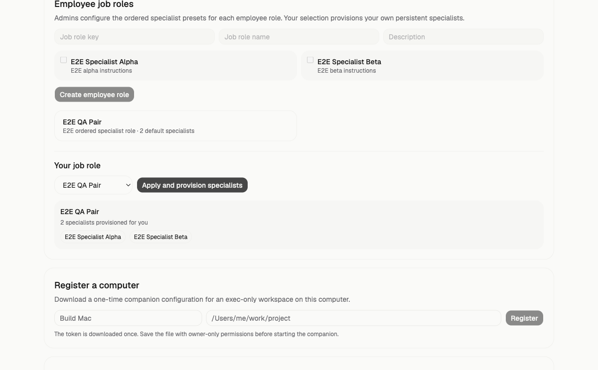
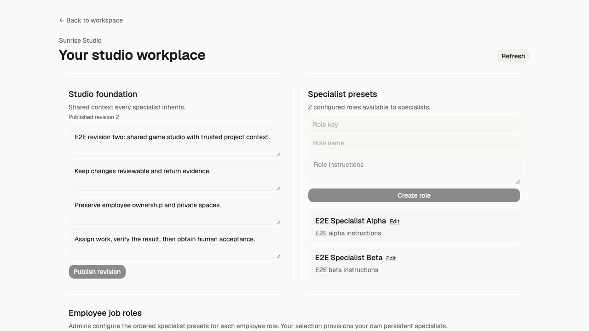
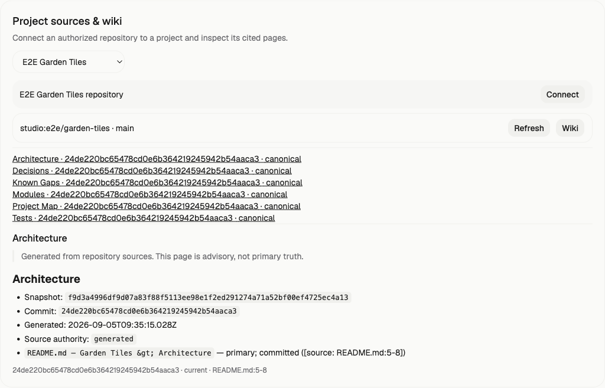
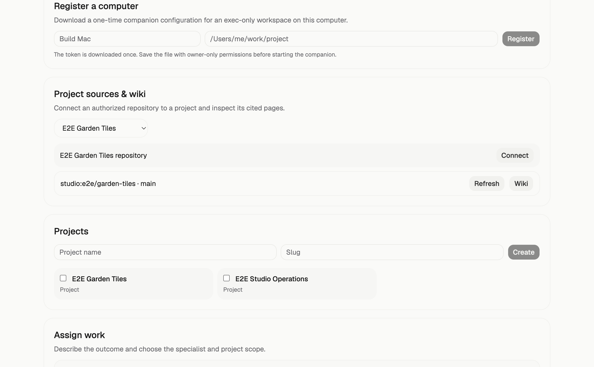
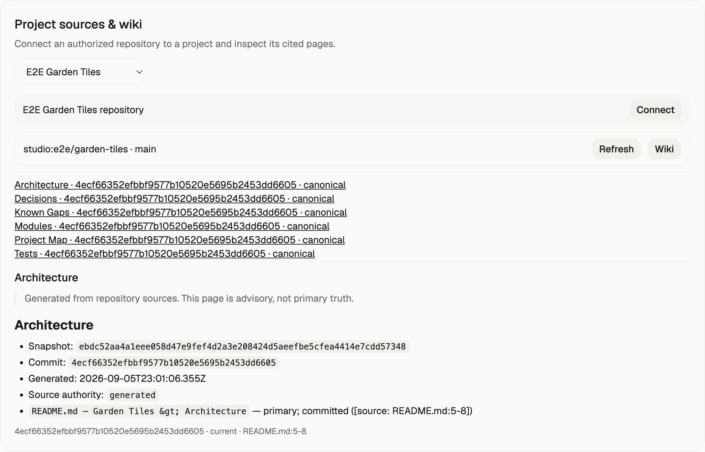
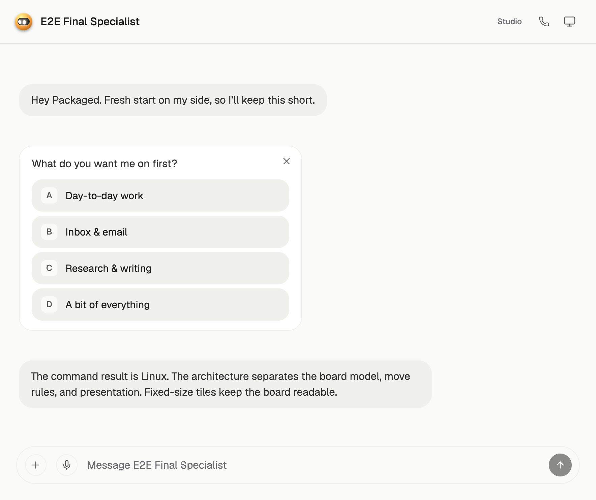
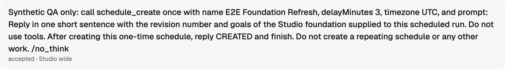
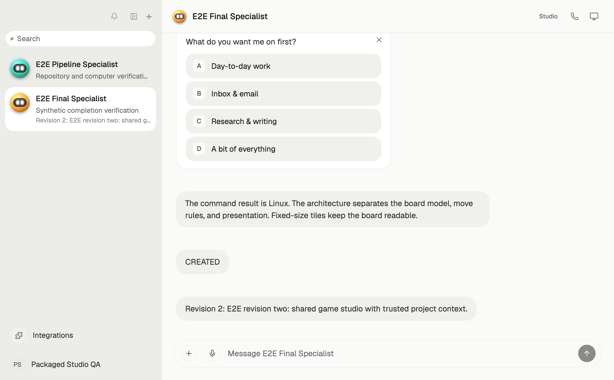
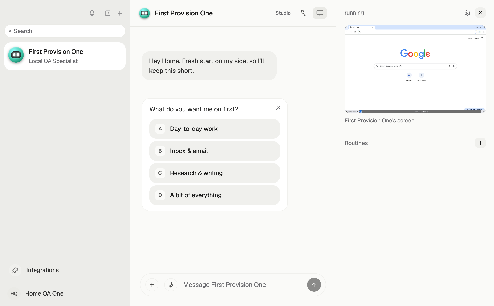

# Packaged end-to-end follow-up

All accounts, sources, objectives and acceptance decisions here are synthetic local QA. This record supplements the earlier delivery evidence; it does not claim a production deployment, configured vendor-provider success, hosted CI, or acceptance of real business work.

## Reviewed corrections

- PR #16 (`188b2082`): acceptance checks both the completed Task and latest linked Run.
- PR #17 (`4560e752`): the real employee CLI uses durable receipts; hashed filenames and strict persisted schemas reject traversal and malformed evidence without replay.
- PR #18 (`b87518c8`): source refresh clears old wiki projections, serializes source mutations, and unfinished acceptance returns a clear conflict.
- PR #19 (`99f13ee5`): future routine fires resolve current foundation/source context; retries retain their effective manifest. Custom bots keep a null role unless a preset was selected.
- PR #20 (`020498ad`): finalization waits up to 30 seconds and retries only the fenced database commit on expiry, never the completed external tool.
- PR #21 (`85d21878`): bounded two-second read-only Docker home visibility retry; symlink/containment failures remain immediate. Fresh packaged QA showed this alone was insufficient.
- PR #22 (`f5e39a41`): containerized supervision validates effective access using the exact computer image, uid and host bind; local fd containment is checked first. The temporary probe has no network, no capabilities, a read-only root, bounded operations and cleanup, and late-creation cleanup fenced by UUID. Standalone validation stays unchanged.

Each correction received an independent review with no remaining P1/P2 finding. A stale PG acceptance fixture was corrected at `8d8b1765` to complete both its Task and Run before the positive acceptance assertion.

## Build and test provenance

The full distribution Dockerfile built app `98e3f0c1f1f2c158ba0cc41b5ecf6a2b0c7e8653` into image `sha256:cc59bb0002c9e0068a1ce6ce592d0cd36a646ff03bc213e2aca572a23833dde1`. A small overlay copied the exact four changed files between that commit and `93a77aea61834135e82cd1527a8230bff03b025d`: two supervisor runtime files and two regression tests. Dependencies and compiled web output are unchanged. That checkpoint image is `sha256:04b4bd770f157f9f73cf4f1e3ea0414def4d62db5908a24459e27440d55a986e`.

The final runtime `f5e39a413cf6b3057c8be42391081ae597fdb82a` adds a six-file supervisor overlay over that image, digest `sha256:ac2f410053b7b5aec6809106d2e9e3bbf3da8ce681bf45d83223b5bd457ab4a0`. API, worker, web, provider MCP and supervisor all use it. Aggregate `61e135d209bc884d242e17dc235d5cc7795edbc8` has identical runtime source; its difference from that runtime commit consists only of evidence files. This is an explicit incremental image over the full distribution build, not a second full dependency build.

At `93a77aea`: 24/24 workspace checks passed. The focused suite passed 209 tests across 12 files with one existing Linux-only skip on macOS. A fresh disposable PostgreSQL database applied all 78 migrations and passed six integrated files, with no skipped tests, then was removed. The separate finalization suite passed 30/30, including a real six-second thread lock, exactly one terminal message/event, unchanged completed effect, and idempotent duplicate finalization.

At integrated `61e135d2`, the final supervisor suite passed **89 tests with one existing Linux-only skip** across five files, and its TypeScript check passed. Independent final review of `f5e39a41` found no remaining P1/P2 issue.

The updated source UI passed the installed-Chrome race regression. Its isolated temporary harness mocked authentication and initial Studio RPC state; it proves component race behavior, while the real packaged journeys below prove authentication and persistence.

## Real packaged journeys

Two new employees joined through invitations, selected E2E QA Pair, provisioned Alpha/Beta, reloaded and reapplied. Actual PostgreSQL rows showed two memberships and four distinct employee-owned specialist bots. Shared role configuration and separate ownership survived reapply.

A separate authenticated employee session exercised the actual packaged RPC boundary: `studio.projects` returned both intended shared projects, `studio.permissions` returned `member` with both management permissions false, and `studio.assignments` returned an empty list while the owner's assignment remained present in PostgreSQL. This verifies shared project visibility and private owner-assignment filtering without mocked responses.

The owner created two projects: E2E Garden Tiles with a source and E2E Studio Operations with none. The registered checkout connected through the canonical scanner/store and real local Ollama embeddings. Source commit `64e4ce2035bb481bd9407f418c562f4aaa86194d` indexed as snapshot `d8eb257e9127feabacf521136ef227f0d01516056967111ddfab098ed9289a92`; refresh indexed `24de220bc65478cd0e6b364219245942b54aaca3` as `f9d3a4996df9d07a83f88f5113ee98e1f2ed291274a71a52bf00ef4725ec4a13`. Both immutable snapshots remained stored. The running assignment retained its original pin when the source advanced.

A second real refresh on the fixed packaged app at `93a77aea` advanced the fixture to commit `4ecf66352efbbf9577b10520e5695b2453dd6605`, snapshot `ebdc52aa4a1eee058d47e9fef4d2a3e208424d5aeefbe5cfea4414e7cdd57348`. Immediately after clicking Refresh, the selected Architecture heading count was zero and Connect, Wiki and source Refresh were all disabled. After real indexing completed, the page list showed only the new revision; opening Architecture displayed the new snapshot and `README.md:5-8` citation.

A newly created custom specialist `cmtoyaa1100004fn1zj1e9q9h` persisted `rolePresetId=null`. Multi-project run `cmtoyg81o000a4fn1t50du00o` used Pi and the real local Qwen model, pinned foundation 1 and the refreshed canonical source, executed one Docker shell command `uname -s`, and completed with exit 0, stdout `Linux\n`, empty stderr. Its model text correctly summarized the architecture but omitted the requested line citation; this record does not claim perfect model citation compliance. The exact source citation is verified in the canonical UI and persisted context.

The earlier combined run `cmto6nba7000l3dqcmw3hxu7u` remains failed evidence: its shell succeeded, then the default five-second database finalization expired at 7.49 seconds. It was not rewritten as a pass. The finalization fix and later completed run are separate evidence.

Premature acceptance returned HTTP 409 and the actionable message below. The one-shot creation assignment `cmtoz342200013dpkpr4t3eq5` completed with `CREATED`; an explicit synthetic QA acceptance then persisted across reload. This exercises acceptance controls and is not human acceptance of a production result.

## Automatic routine context refresh

The real model created one `@once` routine through `schedule_create`: `cmtoz57kr00040zpkbw0eyz9w`. Its stored descriptor selected Studio scope and no role. Foundation revision 2 was published through authenticated `studio.publishFoundation` at `22:50:31.129Z`, before Graphile fired the routine at `22:51:35.848Z`. The original assignment retained revision 1; new Task `cmtoz92jo000f0zpklj8vaexe` and Run `cmtoz92js000g0zpkvma8ey4l` both completed pinned to revision 2. The model returned exactly: “Revision 2: E2E revision two: shared game studio with trusted project context.”

Final observation showed one inactive routine, no next run, exactly one completed routine run, and no duplicate. The creating assignment recorded one completed `schedule_create` effect; the fired run recorded zero effects.

## Fresh Docker computer observation

At `93a77aea`, a brand-new synthetic organization failed first provision with HTTP 500 after the full two-second visibility retry: its fresh home was still reported non-writable for uid 1000. A subsequent user retry returned HTTP 200 and started the computer as `1000:1000`. This means PR #21 alone does not satisfy reliable first provision. Follow-up diagnosis found that Docker Desktop reports synthetic ownership metadata that can disagree with effective access in the target container namespace. PR #22 corrects that access check; its separate fresh-home journey below determines first-provision acceptance. The failed first attempt above remains part of the record.

### Corrected first provision on the final image

A new account created through real signup/onboarding opened bot `First Provision One` (`cmtp0e9w300053dpf2m27mnh3`) and its computer (`cmtp0e9w100043dpf03dkzptx`) in new organization `2e5e965d92f6394492d689e161e45e9c`. Its first browser `POST /rpc/computer/boot` returned 200 in 3272 ms. Supervisor trace `96c4f13a8a566f1c887f9a396b328e8c` recorded the first `POST /computers` as 200 in 3179 ms at `23:24:09.108Z`, followed by setup exec 200 and screen mode 200. Product supervisor execution then returned exit 0, uid 1000, gid 1000, a writable home and persisted marker readback. No model generation was required for this computer test.

A second distinct account repeated real signup/onboarding and opened bot `First Provision Two` (`cmtp0sjwm000m3dpf4s18sodw`), computer `cmtp0sjwk000l3dpfu9x2zv5i`, organization/home `410d5b1455bf3785206f2fde93d4a3e8`. Its first browser boot returned 200 in 3727 ms; supervisor trace `b843a0efc1e30526ee2d266746935701` recorded the first provision as 200 in 3626 ms at `23:35:17.706Z`. Product exec returned exit 0, uid/gid 1000 and writable storage, wrote `second-marker`, and a separate product exec read that same persisted value as uid 1000. No probe containers remained.

Both fresh Docker journeys used the final image and new homes, with no retries, DB seeding or model generation. Their synthetic accounts/computers remain available for review; task browser/authentication artifacts were closed or removed. An unrelated second-test attempt took the employee-host enrollment path and was stopped; it is excluded from Docker proof.

## Host receipt recovery

The final CLI code at `4560e752` was exercised against packaged API `98e3f0c1`. A real HTTP proxy dropped the response only after the API committed the receipt. Before companion restart: marker lines 1, terminal spool entries 1, DB operation completed/exit 0. After a new CLI process with the same configuration: marker lines 1, spool entries 0, DB result unchanged. A stale fence returned 409 and a distinct owner's token returned 401. These were explicit protocol fixtures, not model-created assignments. Their accounts, organizations, hosts, operations and workspaces were removed; final fixture counts were zero.

## Additional observations

Two navigation redirects were observed around service replacement. Four subsequent authenticated deep-link checks, including a traced HTTP-200 bootstrap with the requested bot ID, selected the correct bot. No speculative routing change was made. The earlier missing-thread hypothesis was withdrawn because the thread already existed.

Provider credentials remain unset: MCP transport/security is tested, but no paid vendor action, SMTP delivery, production invitation or native macOS/Xcode/device action is claimed.

Final packaging check validated the pushed application pin and Compose configuration. Superseded unused image tags were removed after the final image started; Docker reported another 281.8 kB reclaimed. Existing containers, volumes and user checkouts were preserved.
